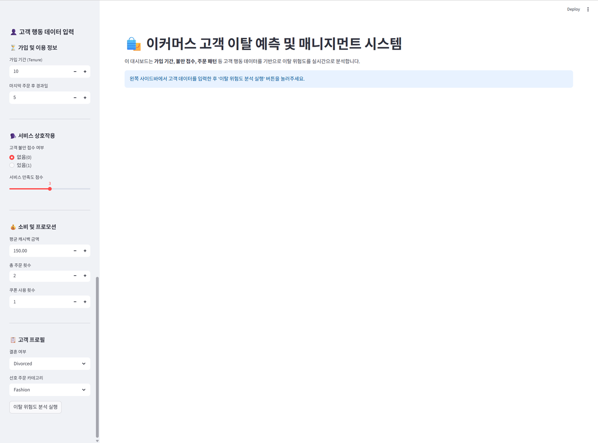
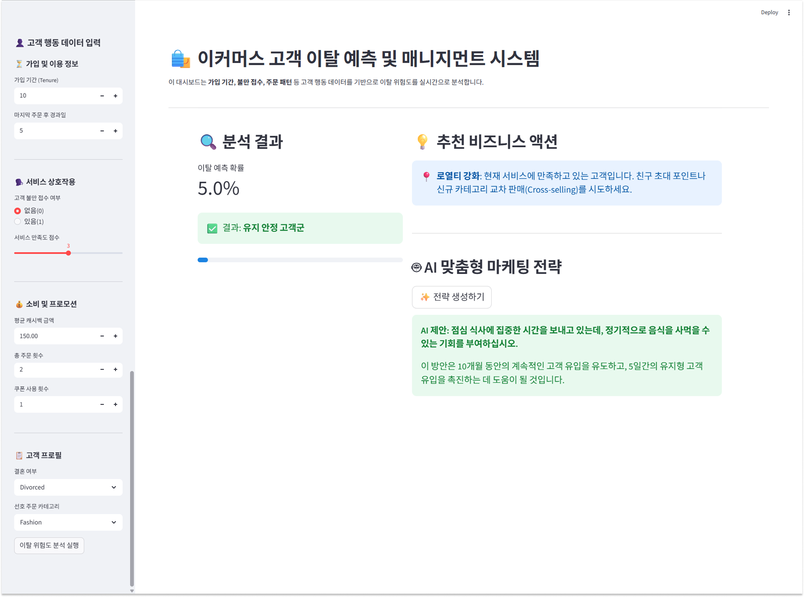
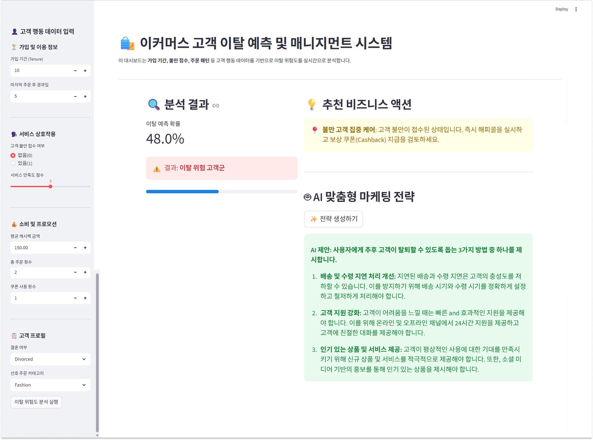

# E-Commerce Churn Prediction

> **E-Commerce Churn Prediction**은 고객 행동 데이터를 기반으로 이커머스 사용자의 이탈 위험도를 실시간으로 분석하고 예측하는 **머신러닝 대시보드 시스템**입니다. **데이터 분석·모델 학습·이탈 예측·비즈니스 액션 제안** 4가지 핵심 기능이 Streamlit 환경에서 완벽하게 구동됩니다.


---

## 서비스 화면

<div align="center">
  
  <br>
  <p><b>E-Commerce Churn Prediction 메인 대시보드</b><br>고객 행동 데이터를 실시간으로 입력하고 분석 결과를 한눈에 확인할 수 있습니다.</p>
</div>

---

## 목차

1. [소개](#1-소개)
2. [주요 화면](#2-주요-화면)
3. [핵심 기능](#3-핵심-기능)
4. [기술 스택](#4-기술-스택)
5. [아키텍처 및 파이프라인](#5-아키텍처-및-파이프라인)
6. [설치 방법](#6-설치-방법)
7. [데이터 및 입력 변수 가이드](#7-데이터-및-입력-변수-가이드)
8. [프로젝트 구조](#8-프로젝트-구조)
9. [머신러닝 모델 상세](#9-머신러닝-모델-상세)
10. [트러블슈팅](#10-트러블슈팅)
11. [향후 로드맵](#11-향후-로드맵)

---

## 1. 소개

온라인 쇼핑 시장의 경쟁이 심화됨에 따라, 신규 고객 유치보다 기존 고객의 유지(Retention)가 비즈니스 수익성에 더 결정적인 역할을 합니다. 본 프로젝트는 고객의 서비스 이용 기간, 불만 접수 내역, 주문 패턴 등을 분석하여 이탈 가능성을 선제적으로 파악하는 솔루션입니다.

**E-Commerce Churn Prediction** 시스템은 실시간 예측 엔진을 통해 개별 고객의 이탈 확률을 시각화하고, 그에 맞는 맞춤형 비즈니스 액션(예: 프로모션 제공, 해피콜 진행 등)을 자동으로 제안합니다.

### 설계 원칙

| 원칙 | 내용 |
|------|------|
| **Real-time Analytics** | 사용자의 입력값에 즉각적으로 반응하여 이탈 확률 계산 |
| **Data-Driven Action** | 단순히 확률만 제공하는 것을 넘어, 실질적 비즈니스 대응책 제안 |
| **User-friendly UI** | 비개발자(마케터, 운영팀)도 쉽게 접근할 수 있는 Streamlit 대시보드 |

**대상 사용자:** 이커머스 마케팅 담당자, CRM 매니저, 데이터 분석가

---

## 2. 주요 화면

<table>
  <tr>
    <td align="center"><b>✅ 유지 안정 고객군 예측 결과</b></td>
    <td align="center"><b>⚠️ 이탈 위험 고객군 예측 결과</b></td>
  </tr>
  <tr>
    <td></td>
    <td></td>
  </tr>
  <tr>
    <td>이탈 확률이 기준치(30%) 미만으로 예측된 화면입니다. '로열티 강화'를 위해 친구 초대 포인트나 신규 카테고리 교차 판매(Cross-selling)를 제안하는 등 고객 상태에 맞춘 액션을 보여줍니다.</td>
    <td>이탈 확률이 30% 이상으로 예측된 화면입니다. 고객의 불만 접수 여부나 가입 기간(Tenure) 등의 세부 조건에 따라 '불만 고객 집중 케어', '재구매 유도' 등 즉각적인 개입을 경고합니다.</td>
  </tr>
</table>

---

## 3. 핵심 기능

| 기능명 | 설명 | 비고 |
|---------|------|-----------|
| **Real-time Churn Prediction** | **[CORE]** Random Forest 모델을 통해 고객 이탈 여부(0/1) 및 확률 도출 | `churn.py` 기반 |
| **AI Business Consultant** | Ollama 기반 생성형 AI(Gemma)가 사장님을 위한 맞춤형 이탈 방지 솔루션 제안 | LLM 연동 (Ollama) |
| **Business Action Recommendation** | 이탈 원인(불만, 가입 초기 등)에 따른 룰 기반의 즉각적인 대응책 제시 | Rule-based 엔진 |
| **Data EDA & Modeling** | `churn.ipynb`를 통한 탐색적 데이터 분석(EDA) 및 모델 튜닝 환경 제공 | 모델 최적화 가능 |

### 대시보드 부가 기능

| 기능 | 내용 |
|------|------|
| **캐싱을 통한 모델 로드 최적화** | `@st.cache_resource`를 사용해 모델 및 인코더 로딩 속도 최적화 |
| **동적 UI 피드백** | 이탈 확률(0.3 기준)에 따라 경고(`st.error`) 또는 안정(`st.success`) 피드백 |
| **AI 전략 생성 가속** | Ollama 서버와의 비동기 통신 및 타임아웃 설정을 통한 안정적인 AI 전략 도출 |
| **원클릭 분석 실행** | 사이드바 폼 입력을 마친 후 분석 실행 버튼을 통한 직관적 인터페이스 |

---

## 4. 기술 스택

**Data Science & ML**  


**Frontend / Dashboard**  


**Model Deployment**  


**Generative AI (Consultant)**  


---

## 5. 아키텍처 및 파이프라인

본 프로젝트는 분석 환경과 서빙 환경이 깔끔하게 분리되어 있습니다.

```
[ Data Analysis & Modeling ]  churn.ipynb (Jupyter Notebook)
           │                  - EDA, Feature Engineering
           │                  - Model Training (Random Forest) -> Main Engine
           │                  - Save .pkl (Model, Encoders)
           ▼
[ Model Assets (data/)     ]  ecommerce_randomforest_model.pkl / ecommerce_labelencoders.pkl
           │
           ▼
[ App Serving (Streamlit)  ]  churn.py (대시보드 앱)
           │                  - 사용자 UI / 입력 폼
           │                  - 실시간 ML 추론 (Predict Proba)
           ▼
[ Hybrid Decision Engine   ]  1. Rule-based Action (즉각 대응)
                              2. LLM AI Consultant (심층 전략 - Ollama)
```

### 추론 및 생성 프로세스

1. **ML 추론**: 사용자가 입력한 데이터를 바탕으로 **Random Forest** 모델이 이탈 확률을 정밀하게 계산합니다. (핵심 알고리즘)
2. **비즈니스 로직**: 계산된 확률과 주요 피처(불만 여부 등)를 결합하여 룰 기반의 즉각적인 액션을 제안합니다.
3. **AI 전략 생성**: 사장님이 원할 경우, **Ollama(Gemma 2B)**가 컨설턴트 페르소나를 통해 데이터 기반의 고도화된 이탈 방지 전략을 추가로 생성합니다.

---

## 6. 설치 방법

### 1. 사전 준비

- Python 3.9+ 권장

### 2. 프로젝트 클론 및 가상환경 설정

```cmd
git clone https://github.com/sssnyyyn/Ecommerce-Churn-Prediction.git
cd Ecommerce-Churn-Prediction
python -m venv .venv
.venv\Scripts\activate
```

### 3. 패키지 설치

```cmd
pip install -r requirements.txt
```

### 4. 애플리케이션 실행

```cmd
streamlit run churn.py
```

명령어 실행 시 웹 브라우저가 열리며 대시보드 화면(`http://localhost:8501`)이 표시됩니다.

---

## 7. 데이터 및 입력 변수 가이드

모델이 사용하는 핵심 피처(Feature)는 다음과 같습니다:

| 카테고리 | 변수명 | 설명 | 기본값 설정 |
|----------|--------|------|-------------|
| **가입/이용** | `Tenure` | 서비스 가입 후 유지 기간 (월/년) | 10 |
| **가입/이용** | `DaySinceLastOrder` | 마지막 구매 이후 경과일 | 5 |
| **상호작용** | `Complain` | 고객 불만 접수 여부 (0=없음, 1=있음) | 0 |
| **상호작용** | `SatisfactionScore` | 고객 만족도 평가 점수 (1~5점) | 3 |
| **소비패턴** | `CashbackAmount` | 평균 제공된 캐시백 금액 | 150.0 |
| **소비패턴** | `OrderCount` | 고객의 총 누적 정기 주문 횟수 | 2 |
| **소비패턴** | `CouponUsed` | 프로모션 쿠폰 사용 횟수 | 1 |
| **프로필** | `MaritalStatus` | 결혼 여부 (Single, Married 등) | - |
| **프로필** | `PreferedOrderCat` | 주 선호 구매 카테고리 | - |

---

## 8. 프로젝트 구조

```
Ecommerce-Churn-Prediction/
├─ churn.py                      # Streamlit 웹 대시보드 메인 앱
├─ churn.ipynb                   # 데이터 탐색 및 모델 학습용 주피터 노트북
├─ requirements.txt              # 파이썬 의존성 패키지 목록
├─ README.md                     # 프로젝트 설명서
└─ data/                         # 데이터 및 모델 에셋 폴더
   ├─ ecommerce_randomforest_model.pkl  # 학습 완료된 Random Forest 모델 파일
   └─ ecommerce_labelencoders.pkl       # 범주형 변수 변환용 인코더
```

---

## 9. 머신러닝 모델 상세

현재 채택된 메인 모델은 **Random Forest Classifier** 입니다.

| 항목 | 상세 내용 |
|------|-----------|
| **모델 알고리즘** | Random Forest (앙상블 기법을 통한 과적합 방지 및 비선형성 포착) |
| **분류 기준 (Threshold)** | 예측 확률 **30% (0.3)** 이상 시 이탈(Churn) 징후로 판별 |
| **입력 차원** | 9개의 피처 연속형 및 범주형 데이터 |
| **학습 환경** | `churn.ipynb` 환경 내 Scikit-Learn |

이커머스 이탈 데이터는 불균형 데이터일 확률이 높으므로, 보수적인 타겟 마케팅을 위해 Threshold 값을 0.3으로 비교적 낮게 설정하여 이탈 의심 고객을 폭넓게 포착하도록 설계되었습니다.

---

## 10. 트러블슈팅

### Streamlit 앱 실행 시 모듈 없음(ModuleNotFoundError)
가상 환경 활성화 후 `requirements.txt` 내 패키지(예: `streamlit`, `pandas`, `scikit-learn`)가 정상 설치되었는지 확인하십시오.
```cmd
pip install -r requirements.txt
```

### 모델 파일(.pkl) 로드 에러 (FileNotFoundError)
`churn.py`는 `data/` 폴더 하위에 `.pkl` 파일이 위치하는 것을 전제로 합니다. 파일 경로가 유실되었거나 파일이 없는 경우, `churn.ipynb`를 전체 실행하여 `.pkl` 파일들을 재생성해 주십시오.

### Label Encoder 클래스 오류
데이터에 없는 새로운 범주(Category) 값을 입력하려 할 때 발생합니다. `churn.py` UI의 `selectbox`는 학습 시 사용된 클래스(`classes_`)만을 선택 옵션으로 제공하여 이 오류를 원천 차단합니다.

---

## 11. 향후 로드맵

### 단기
- **시각화 강화:** EDA 과정에서 도출된 고객 특성 분포표나 변수 중요도(Feature Importance) 차트를 Streamlit에 통합
- **데이터 저장:** 사용자가 입력한 데이터와 예측 결과를 CSV나 DB 스토리지에 로깅

### 중기
- **모델 앙상블 적용:** XGBoost, LightGBM 모델 추가 후 예측력을 비교하는 탭 구성
- **A/B 테스트 기능:** 제안된 액션(쿠폰 제공 등) 실행 후 실제 리텐션율 비교 기록

### 장기
- **자동 재학습 파이프라인 (MLOps):** 주기적으로 신규 데이터를 수집하여 모델을 리트레이닝하는 스케줄러 구축
- **대규모 트래픽 대응:** FastAPI를 통해 추론 엔진을 분리하고, 대시보드와 분리된 마이크로서비스(MSA) 아키텍처로 확장

---
